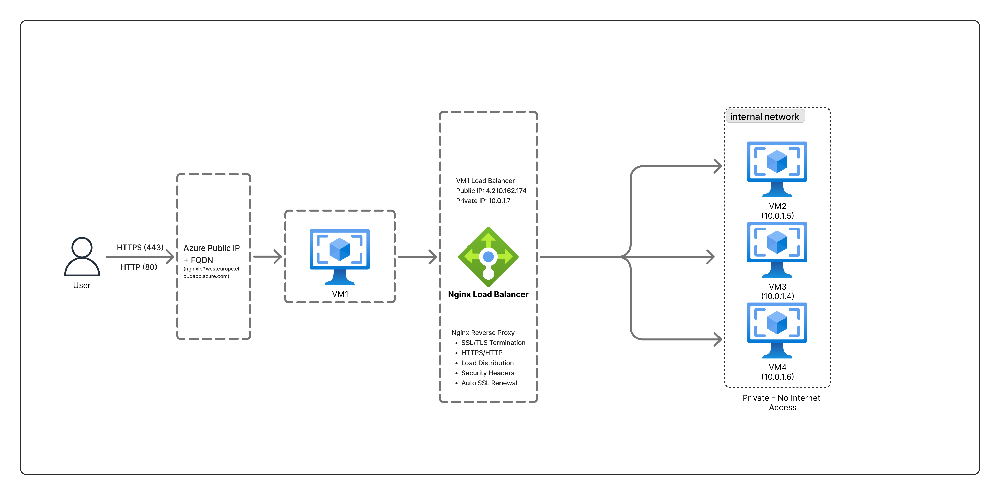

# Azure Load Balancer with Terraform and Ansible

A production-ready infrastructure setup that deploys an Nginx load balancer with SSL/HTTPS support and multiple backend web servers on Azure using Terraform and Ansible.

## 🏗️ Architecture Overview

This project creates a classic 3-tier load balancer architecture:



## 🎯 What Each Component Does

### VM-1: Load Balancer (Public-Facing)
**Role**: Reverse Proxy / SSL Termination / Traffic Distribution

**Responsibilities:**
- **SSL/TLS Handling**: Manages HTTPS connections and SSL certificates
- **Load Distribution**: Distributes incoming requests across backend servers using round-robin
- **Security**: Acts as the only public entry point, protecting backend servers
- **HTTP → HTTPS Redirect**: Automatically redirects all HTTP traffic to HTTPS
- **Security Headers**: Adds HSTS, X-Frame-Options, X-Content-Type-Options, etc.

**Configuration:**
- Public IP with Azure FQDN
- Ports: 22 (SSH), 80 (HTTP), 443 (HTTPS)
- Let's Encrypt SSL certificate (auto-renewing)
- Nginx configured as reverse proxy

### VM-2, VM-3, VM-4: Backend Web Servers (Private)
**Role**: Application/Web Servers

**Responsibilities:**
- **Content Serving**: Run the actual web application
- **Request Processing**: Handle business logic and generate responses
- **High Availability**: Multiple servers ensure service continuity

**Configuration:**
- Private IPs only (no internet access)
- Port: 80 (HTTP) - accessible only from VM-1
- Nginx configured as web server
- Custom HTML pages showing which server responded

## 🔄 Traffic Flow Example

### User Request Flow:
```
1. User → https://nginx-lb-*.cloudapp.azure.com
2. DNS → Resolves to 4.210.162.174 (VM-1 Public IP)
3. VM-1 → Receives HTTPS request
4. VM-1 → Decrypts SSL/TLS
5. VM-1 → Forwards HTTP request to VM-2 (10.0.1.5)
6. VM-2 → Processes request, generates HTML
7. VM-2 → Sends response back to VM-1
8. VM-1 → Encrypts response with SSL
9. VM-1 → Sends HTTPS response to user
10. User → Sees "Running on 10.0.1.5"

Next request goes to VM-3, then VM-4, then back to VM-2 (round-robin)
```

## 📦 Infrastructure Components

### Networking
- **Virtual Network**: 10.0.0.0/16
- **Subnet**: 10.0.1.0/24 (all VMs in same subnet)
- **Public IP**: Static IP with Azure FQDN
- **NSG (Public)**: Allows SSH (22), HTTP (80), HTTPS (443) from internet
- **NSG (Private)**: Allows SSH (22), HTTP (80) only from subnet

### Compute
- **4 Virtual Machines**: Standard_B1s (1 vCPU, 1GB RAM)
  - 1x Load Balancer (public)
  - 3x Web Servers (private)
- **OS**: Ubuntu 20.04 LTS
- **SSH Keys**: Auto-generated via Azure API

### Storage
- **Boot Diagnostics**: Storage account for VM troubleshooting

### Security
- **SSL Certificate**: Let's Encrypt (free, auto-renewing)
- **Network Isolation**: Backend VMs not accessible from internet
- **SSH Key Authentication**: No password authentication
- **Security Headers**: HSTS, XSS protection, clickjacking prevention

## 💡 Benefits of This Architecture

### High Availability
- If one backend VM fails, traffic automatically routes to healthy VMs
- No single point of failure for application servers
- Load balancer can be scaled horizontally by adding more backend VMs

### Security
- **Defense in Depth**: Backend servers isolated from internet
- **SSL Termination**: Centralized certificate management
- **Attack Surface Reduction**: Only one public IP exposed
- **Network Segmentation**: Private subnet for application tier

### Scalability
- **Horizontal Scaling**: Add more backend VMs easily
- **Load Distribution**: Automatic traffic distribution
- **Resource Optimization**: SSL processing on dedicated VM

### Performance
- **SSL Offloading**: Backend VMs don't handle SSL overhead
- **Connection Pooling**: Efficient backend connections
- **HTTP/2 Support**: Modern protocol for better performance

### Maintainability
- **Centralized SSL**: One place to manage certificates
- **Easy Updates**: Update backend VMs without downtime
- **Monitoring**: Single entry point for traffic analysis
- **Automation**: Infrastructure as Code (Terraform + Ansible)

## 🚀 Quick Start

### Prerequisites
- Azure account with active subscription
- Azure CLI installed and authenticated (`az login`)
- Terraform >= 0.12
- Ansible >= 2.9
- SSH client

### 1. Deploy Infrastructure with Terraform

```bash
cd terraform
terraform init
terraform apply
```

This creates:
- 1 Resource Group
- 1 Virtual Network + Subnet
- 2 Network Security Groups
- 4 Virtual Machines
- 1 Public IP with FQDN
- 1 Storage Account
- SSH Key Pair

### 2. Save SSH Key

```bash
terraform output -raw ssh_private_key > ~/.ssh/azure_lb_key
chmod 600 ~/.ssh/azure_lb_key
```

### 3. Configure with Ansible

```bash
cd ../ansible
./update_inventory.sh
```

This automatically:
- Fetches IPs from Terraform
- Updates Ansible inventory
- Configures Nginx settings
- Updates SSL configuration

### 4. Update Email for SSL Certificate

```bash
nano group_vars/azure_proxy.yml
# Change: certbot_email: "your-email@example.com"
```

### 5. Run Ansible Playbook

```bash
ansible-playbook pb.yml
```

This configures:
- Nginx on all VMs
- SSL certificate from Let's Encrypt
- Load balancer with HTTPS
- Backend web servers
- Auto-renewal cron job

### 6. Test Your Setup

```bash
# Get your URL
cd ../terraform
terraform output lb_fqdn

# Test HTTPS
curl https://$(terraform output -raw lb_fqdn)

# Test load balancing (run multiple times)
for i in {1..10}; do 
  curl -s https://$(terraform output -raw lb_fqdn) | grep "Running on"
done
```

You should see responses from different backend VMs (10.0.1.5, 10.0.1.4, 10.0.1.6)!

## 📊 Resource Summary

| Resource | Count | Purpose |
|----------|-------|---------|
| Resource Group | 1 | Container for all resources |
| Virtual Network | 1 | Private network (10.0.0.0/16) |
| Subnet | 1 | VM subnet (10.0.1.0/24) |
| Public IP | 1 | Load balancer public access |
| Network Security Groups | 2 | Firewall rules (public + private) |
| Network Interfaces | 4 | One per VM |
| Virtual Machines | 4 | 1 LB + 3 web servers |
| Storage Account | 1 | Boot diagnostics |
| SSH Key Pair | 1 | Auto-generated for VM access |

**Total Resources**: 25

## 🔐 Security Features

- ✅ SSL/TLS encryption (HTTPS)
- ✅ Let's Encrypt certificates (free, trusted)
- ✅ Automatic certificate renewal
- ✅ HTTP to HTTPS redirect
- ✅ HSTS (HTTP Strict Transport Security)
- ✅ Security headers (XSS, clickjacking protection)
- ✅ Network isolation (private backend VMs)
- ✅ SSH key authentication only
- ✅ Minimal attack surface (one public IP)
- ✅ TLS 1.2 and 1.3 only

## 📁 Project Structure

```
.
├── README.md                          # This file
├── QUICKSTART.md                      # Quick deployment guide
├── SSL_SUMMARY.md                     # SSL setup summary
├── terraform/
│   ├── main.tf                        # Infrastructure definition
│   ├── providers.tf                   # Provider configuration
│   ├── variables.tf                   # Input variables
│   ├── outputs.tf                     # Output values                    
# Terraform documentation
└── ansible/
    ├── pb.yml                         # Main playbook
    ├── ansible.cfg                    # Ansible configuration
    ├── update_inventory.sh            # Auto-update script
    ├── inventory/
    │   └── azure.ini                  # Inventory file
    ├── group_vars/
    │   └── azure_proxy.yml            # Load balancer variables
    ├── files/
    │   ├── nginx.conf                 # Backend nginx config
    │   └── nginx_proxy.conf           # LB nginx config (HTTP)
    ├── templates/
    │   ├── index.html.j2              # Backend HTML template
    │   ├── nginx_http_temp.conf.j2    # Temp HTTP config
    │   └── nginx_proxy_ssl.conf.j2    # LB nginx config (HTTPS)
    ├── SSL_SETUP.md                   # Detailed SSL guide
```

## 🧪 Testing Load Balancing

### Test 1: Verify Load Distribution
```bash
for i in {1..10}; do 
  curl -s https://your-domain.cloudapp.azure.com | grep "Running on"
done
```

Expected output shows different backend IPs:
```
Running on 10.0.1.5
Running on 10.0.1.4
Running on 10.0.1.6
Running on 10.0.1.5
...
```

### Test 2: Check SSL Certificate
```bash
openssl s_client -connect your-domain.cloudapp.azure.com:443 -servername your-domain.cloudapp.azure.com < /dev/null
```

### Test 3: Verify HTTP Redirect
```bash
curl -I http://your-domain.cloudapp.azure.com
```

Should return `301 Moved Permanently` with `Location: https://...`

### Test 4: Check Security Headers
```bash
curl -I https://your-domain.cloudapp.azure.com
```

Should include:
- `Strict-Transport-Security`
- `X-Frame-Options`
- `X-Content-Type-Options`
- `X-XSS-Protection`

## 🛠️ Maintenance

### View Deployment Summary
```bash
cd terraform
terraform output deployment_summary
```

### SSH to Load Balancer
```bash
ssh -i ~/.ssh/azure_lb_key azureadmin@<PUBLIC_IP>
```

### SSH to Backend VM (through jump host)
```bash
ssh -i ~/.ssh/azure_lb_key -J azureadmin@<PUBLIC_IP> azureadmin@10.0.1.5
```

### Check SSL Certificate Status
```bash
ssh -i ~/.ssh/azure_lb_key azureadmin@<PUBLIC_IP>
sudo certbot certificates
```

### Manual Certificate Renewal
```bash
sudo certbot renew
sudo systemctl reload nginx
```

### View Nginx Logs
```bash
# On load balancer
sudo tail -f /var/log/nginx/access.log
sudo tail -f /var/log/nginx/error.log

# On backend VM
ssh -J azureadmin@<PUBLIC_IP> azureadmin@10.0.1.5
sudo tail -f /var/log/nginx/access.log
```

## 🔄 Scaling

### Add More Backend Servers

1. Update `main.tf`:
```hcl
resource "azurerm_linux_virtual_machine" "backend_vm" {
  count = 5  # Change from 3 to 5
  ...
}
```

2. Apply changes:
```bash
terraform apply
```

3. Update Ansible configuration:
```bash
cd ../ansible
./update_inventory.sh
ansible-playbook pb.yml
```

## 🧹 Cleanup

To destroy all resources:

```bash
cd terraform
terraform destroy
```

This will remove:
- All 4 VMs
- Network resources
- Storage account
- Public IP
- Everything created by Terraform


